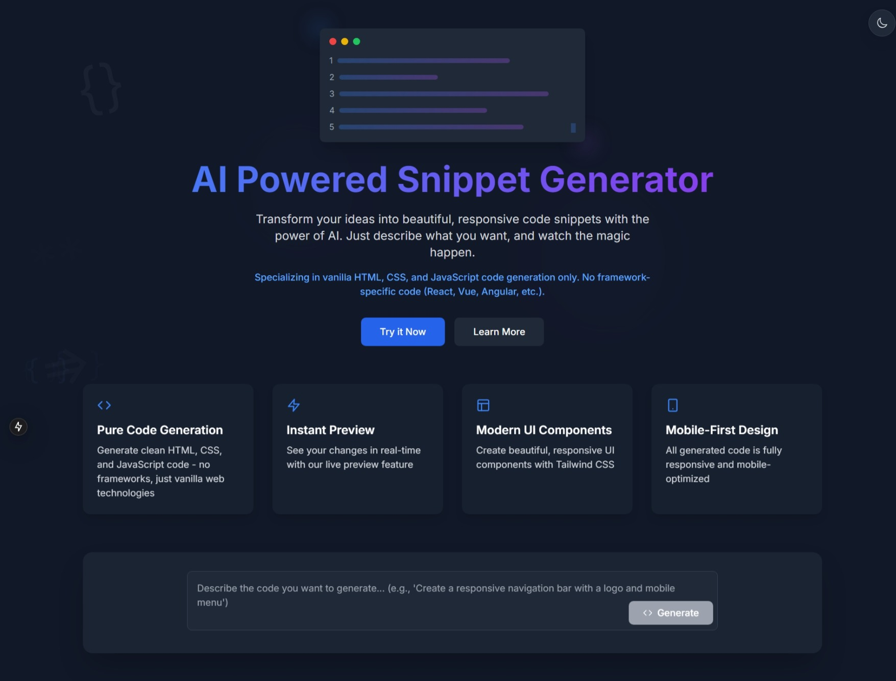

# AI-Powered Code Snippet Generator

A modern web application that generates code snippets using AI technology. Built with Next.js 15, TypeScript, and TailwindCSS, this tool helps developers quickly generate vanilla HTML, CSS, and JavaScript code snippets based on natural language descriptions.



## ✨ Features

- 🤖 AI-powered code generation
- 💻 Live code preview
- 🎨 Syntax highlighting with CodeMirror
- 🌓 Dark/Light theme support
- 📱 Responsive design
- ⚡ Real-time code editing
- 🔄 Copy code with one click

## 🚀 Getting Started

### Prerequisites

- Node.js 18+ 
- npm or yarn

### Installation

1. Clone the repository:
```bash
git clone https://github.com/abdulali821/ai-powered-snippet.git
cd ai-powered-snippet
```

2. Install dependencies:
```bash
npm install
# or
yarn install
```

3. Create a `.env` file in the root directory and add your API key:
```env
GOOGLE_API_KEY=your_api_key_here
```

4. Run the development server:
```bash
npm run dev
# or
yarn dev
```

Open [http://localhost:3000](http://localhost:3000) to view the application.

## 🛠️ Built With

- [Next.js](https://nextjs.org/) - The React framework for production
- [TypeScript](https://www.typescriptlang.org/) - For type safety
- [TailwindCSS](https://tailwindcss.com/) - For styling
- [Framer Motion](https://www.framer.com/motion/) - For animations
- [CodeMirror](https://codemirror.net/) - For code editing
- [Google Generative AI](https://cloud.google.com/ai-platform) - For code generation

## 📝 Usage

1. Enter a description of the code you want to generate in the text area
2. Click "Generate Code" to create the snippet
3. View the generated code in the editor
4. Use the live preview to see the result
5. Copy the code with one click
6. Edit the code directly in the editor if needed

## 🤝 Contributing

Contributions are welcome! Please feel free to submit a Pull Request.

## 📄 License

This project is licensed under the Open Source License - see the [LICENSE](LICENSE) file for details.

## 🙏 Acknowledgments

- Google Generative AI for powering the code generation
- The Next.js team for the amazing framework
- The open-source community for all the great packages

## 📧 Contact

LinkedIn - [@iamabdulali](https://linkedin.com/iamabdulali)

Email : [iamabdulali1@gmail.com](mailto:iamabdulali1@gmail.com?subject=Contact%20from%20Website&body=Hi%20there!%20I%20have%20a%20question%20about%20your%20project.)
